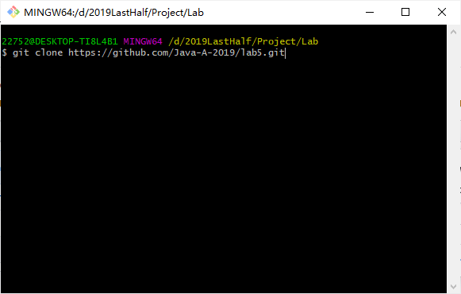

# lab5

    本次 lab 的目标有：
    1. 熟悉数组的基本操作
    2. 熟悉方法（method）的编写，将二维数组视为矩阵，实现矩阵的加、减、乘运算方法
    3. 初探文件读取/存储操作，为文件读取与存储操作封装方法
    4. 以上

## Lab 要求

1. 请先从 GitHub 下载作业，然后使用 IntelliJ 打开 Lab5_Solution 工程。
2. 在本次 lab 中，需要你在 Lab5 这个类中完成 矩阵加、减 方法的编写。
3. 运行 TestLab5 ，你将得到正误的评判。给 TA 当面检查后，请上传至 FTP 本次 lab 的文件夹下。

## 井字棋回顾

在上个 lab 中，大多数同学的代码都写的非常长，远远超过了必要的行数。代码多本身不是什么坏事，但往往反映了在解决问题时没有选择最优的方法，或是在具体的实现逻辑上出现了问题。不少同学在完成基础功能后，做附加功能时要修改之前的代码就无从下手了。

因此，希望同学们在完成每个 lab 后养成回顾的习惯，思考自己的代码还有哪些可以优化的地方。TA 在上次 lab 结束后也提供一份最佳实践供大家阅读和思考。

在开始今天的内容前，花 10 - 15 分钟阅读 [Lab 4 最佳实践](https://github.com/Java-A-2019/lab4/issues/1) 。

## 打开 Lab5_Solution

这次详细介绍一下使用 git 下载本次 lab

1. 打开你希望将本 lab 项目下载到的文件夹路径，比如 TA 的路径是 `D:\2019LastHalf\Project\Lab`
    

2. 鼠标右键，弹出选择栏，选择 `Git Bash Here` 选项开启 git bash
    

3. 在 git bash 中输入命令 

        git clone <本 lab 的 https 地址>

    

4. 下载完成，使用 Intellij 打开 Lab5_Solution

    

    

## 矩阵运算

今天，19sser 的小 A 突发奇想，想要自己实现一套矩阵运算的方法，这样以后矩阵运算就再也不要动脑子了！于是小 A 写好了框架，请你为小 A 补全方法

### 矩阵加法与减法

设矩阵 ，,
　　
则 
 
简言之，两个矩阵相加减，即它们相同位置的元素相加减！
> 注意：只有对于两个行数、列数分别相等的矩阵（即同型矩阵），加减法运算才有意义，即加减运算是可行的．

> 编写完成一个方法后，可以使用 TestLab5 对单个方法进行测试

## 文件读取/存储操作

经过你的帮助，小 A 完成了矩阵的加法与减法方法

但是，小 A 意识到一个问题，就是：

**虽然对于矩阵 A 与 B 来说，可以使用二维数组表示矩阵，但是每次进行矩阵运算的时候都要修改代码，有点麻烦**

小 A 想：

能否通过读取方法来让程序自动读取文件生成表示矩阵的二维数组？

能否通过存储方法来让程序将计算结果存储下来？

于是，小 A 写了以下几个文件：

> 为了简化代码，小 A 只考虑 4 x 4 矩阵的加法运算与减法运算

- `plus.left.in`: 
  - 描述：这是一个用于计算矩阵加法的输入文件，它表示左矩阵
  - ```
    1 1 1 1
    0 0 0 0
    1 1 1 1
    0 0 0 0
    ```

- `plus.right.in`: 
  - 描述：这是一个用于计算矩阵加法的输入文件，它表示右矩阵
  - ```
    1 0 1 0
    1 0 1 0
    1 0 1 0
    1 0 1 0
    ```

- `plus.out`:
  - 描述：这是由你的程序生成的文件，它将矩阵加法结果存储下来
  - ```
    2 1 2 1
    1 0 1 0
    2 1 2 1
    1 0 1 0
    ```

- `minus.left.in`: 
  - 描述：这是一个用于计算矩阵减法的输入文件，它表示左矩阵
  - ```
    1 1 1 1
    0 0 0 0
    1 1 1 1
    0 0 0 0
    ```

- `minus.right.in`: 
  - 描述：这是一个用于计算矩阵减法的输入文件，它表示右矩阵
  - ```
    1 0 1 0
    1 0 1 0
    1 0 1 0
    1 0 1 0
    ```

- `minus.out`:
  - 描述：这是由你的程序生成的文件，它将矩阵减法结果存储下来
  - ```
    0 1 0 1
    -1 0 -1 0
    0 1 0 1
    -1 0 -1 0
    ```

希望你能继续帮小 A 完成文件读取与存储方法

## Bonus

    大家熟悉的 Bonus 又来啦~
    
    写完 lab 的同学一定发现了这个问题：矩阵运算怎么可能只有加法与减法呢？矩阵怎么可能只有 4 x 4 的呢？

    如果你愿意的话，请补全矩阵运算的乘法部分：
    1. 矩阵与数的乘法
    2. 矩阵与矩阵的乘法
    此外，可以尝试读取不同格式的矩阵

    然后进行自测

### 矩阵与数的乘法

数  乘矩阵 A，就是将数乘矩阵 A 中的每一个元素，记为 ．

### 矩阵与矩阵的乘法

设 ，，则A与B的乘积  是这样一个矩阵：
1. 行数与（左矩阵）A 相同，列数与（右矩阵）B 相同，即 ．
2. C 的第 i 行第 j 列的元素  由A的第 i 行元素与B的第 j 列元素对应相乘，再取乘积之和．